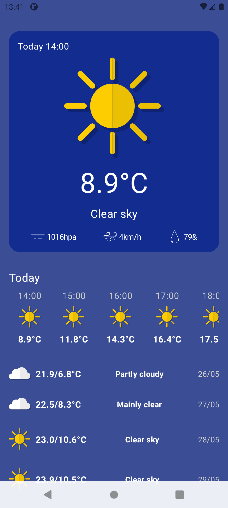

# Weather Sky 

  
   

## Приложение для прогноза погоды

- Прогноз погоды на текущей день 

- Отображает давление/ветер/влажность

- Прогноз на 7 дней и Макс/Мин

- Работает через Location сервис

## Используемые технологии

- Jetpack Compose
- Navigation
- MVVM
- Coroutines
- Dagger - Hilt
- Retrofit
- Coil
- Room

